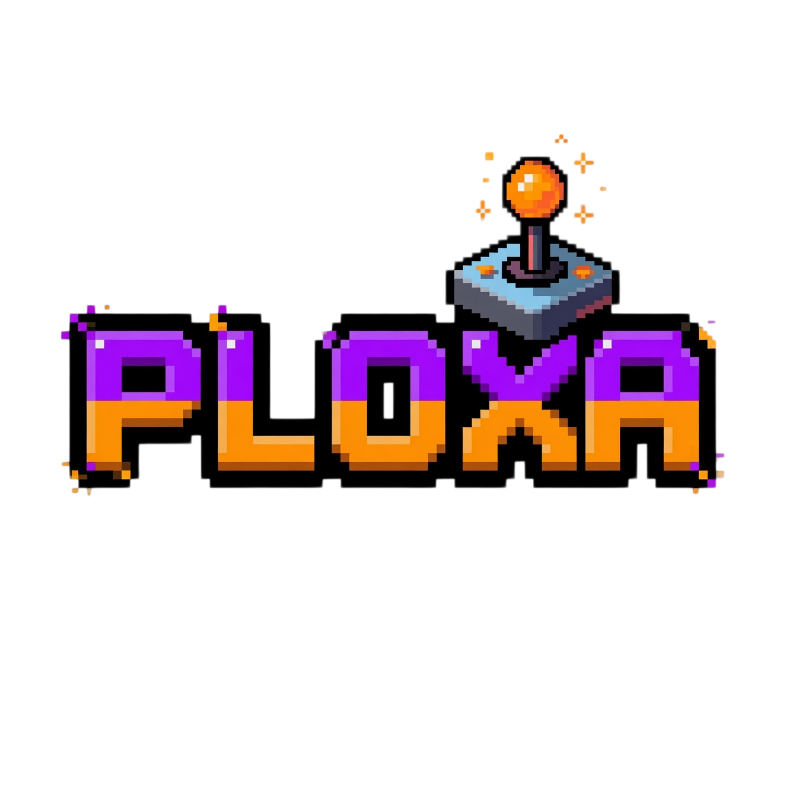

<div align="center">



### An AI-first game tracker with a pixel-art mascot, premium dark-mode polish, and a taste fingerprint that actually knows you.

[**Live demo →**](https://ploxa.vercel.app)

[](https://nextjs.org/)
[](https://www.typescriptlang.org/)
[](https://tailwindcss.com/)
[](https://supabase.com/)
[](https://orm.drizzle.team/)
[](https://vercel.com/)
[](#-testing)

</div>

---

## ✨ What it is

Ploxa is the game tracker for people who treat games like media to discuss — not boxes to check. Log what you play, rate it, write a review with a sardonic AI host that interviews you about it, and let your **taste fingerprint** quietly learn what you actually like. Then ask the mascot what to play next.

The unclaimed visual position the project was built for: every game tracker on the market looks like a spreadsheet, a Discord bot, or a launcher. Ploxa is the first one designed like a Raycast app — refined micro-interactions, opinionated dark mode, and pixel art used as accent (badges, mascot, year-in-review), never as wallpaper.

## 🎮 What's shipped

| Phase | Surface | Status |
|---|---|---|
| 0 — Foundation | Auth, design system, mascot stub, full DB schema | ✅ |
| 1 — Core Logging | RAWG search, status/rating/notes, library page | ✅ |
| 1.5 — Polish | Filter chips, sort dropdown, profile, perf sweep | ✅ |
| 2 — AI Reviews | Multi-provider router, interview-style review drafts | ✅ **soft launch** |
| 3 — Library Imports | Steam (official) + Xbox (OpenXBL) + manual; PSN deferred | ✅ |
| 4 — Taste Fingerprint | Weighted vector aggregation, AI narrative, recs | ✅ |
| 5 — Social Layer | Follows, feed, comments, lists, notifications, moderation | ✅ **beta launch** |
| 6 — Year-in-Review | Spotify-Wrapped-style annual retrospective | ⬜ next |
| 7 — Polish + Launch | Commissioned mascot art, public launch | ⬜ |

## 🧠 How it works

The AI surfaces — narrative-style taste summaries, recommendation re-ranking, and review-interview hosting — all run through a **provider router** that tries four LLM APIs in fallback order, picking the first that responds within 30 seconds:

```
request  ──►  Cerebras (Llama 3.1, free tier)
        ──►  Groq (Llama 3.3 70B, free tier)
        ──►  Cloudflare Workers AI (free tier)
        ──►  DeepSeek V3 (paid overflow)
        ──►  AIProvidersExhaustedError → graceful UI fallback
```

Every call writes a row to `ai_calls` so the cost dashboard sees Edge Function traffic with the same fidelity as Next-side traffic. The Next-side router and the Deno Edge mirror share prompt versions through a vendored `_shared/prompts.ts` — bumping `NARRATIVE_PROMPT_VERSION` triggers re-narration on next drift-cron tick.

Catalog data flows through **two enrichment passes**: RAWG provides the base game record (cover, genres, description, platforms), then IGDB fills mechanics + game modes + player perspectives via a 151-entry hand-curated vocabulary. Games IGDB can't map cleanly get a final pass through `gpt-4o-mini` strict-mode JSON classification — final mechanics coverage sits at **99.9%** across the live catalog.

## 🛠️ Tech

| Layer | Choice | Why |
|---|---|---|
| **Framework** | Next.js 16 App Router (Turbopack) | RSC + Server Actions remove the API layer for most CRUD |
| **Language** | TypeScript strict | Strict mode catches Next 16 Server Action validation regressions |
| **Styling** | Tailwind CSS v4 with CSS-vars theme | `@theme inline` token bridge keeps `--accent`/`--pixel` swappable |
| **Auth + DB** | Supabase (Auth, Postgres, Storage, Edge Functions) | Magic links + email/password + row-level security baked in |
| **ORM** | Drizzle | Schema-first migrations + drift detector CI gate |
| **AI router** | Custom (Cerebras → Groq → Cloudflare → DeepSeek) | Llama 3.3 70B as the common denominator across all four |
| **Catalog** | RAWG (base) + IGDB (mechanics enrichment) | Free tier covers 100K MAU on RAWG; IGDB free with Twitch OAuth |
| **State** | TanStack Query (server cache) + Zustand (UI state) | Cache-shared between routes; no global state outside auth context |
| **Animation** | Framer Motion (now `motion`) | Mascot mood transitions, page reveals, layout animations |
| **Email** | Resend | Transactional digests; supports React Email templates |
| **Cache** | Upstash Redis | Rate-limit buckets + recs cache; serverless-friendly |
| **Hosting** | Vercel (free tier) | Auto-deploy from `main`, Edge Functions for AI hot path |
| **Fonts** | Geist Sans + Geist Mono + Pixelify Sans | The pixel font is the accent — body UI stays modern |

## 🎬 Highlights

- **Mascot with state machine.** Six pixel-art moods (idle, waving, thinking, celebrating, concerned, mascot-says-bubble) wired to a Zustand store. Celebratory by default, never chat-interruptive — the "no Clippy syndrome" rule is enforced at the store level. Opt-in chat mode for users who want more.
- **Taste fingerprint, not a recommender model.** Each log gets a weighted contribution (rating × intensity, status modifier, review-published bonus) that flows into per-axis vector sums (genres, themes, mechanics, game modes, player perspectives). Stored as sparse JSONB. The "narrative" — a 2–3 sentence AI summary in your voice — is regenerated by a daily drift-cron only when vectors meaningfully diverge from their last-narrated snapshot.
- **Multi-provider AI router with telemetry parity.** Same `callRouter()` signature on the Next side and inside Supabase Edge Functions. Every attempt — success or fail — writes to `ai_calls` for cost tracking. 30-second per-provider timeout cuts the worst-case tail, not the median.
- **Library imports via adapter pattern.** Steam uses the official Web API. Xbox uses OpenXBL (unofficial but stable). PSN is deferred — the `psn-api` lib is experimental and Sony breaks it quarterly. Manual imports cover Switch + everything else. The adapter shape is the same across providers so the UI degrades gracefully when an unofficial source falls over.
- **Pixel art as accent, Raycast polish as default.** Dark-mode-first design tokens, generous whitespace, refined micro-interactions, custom shelf-frame around game posters, hand-drawn status icons. Body UI is `Geist Sans` modern; the pixel chrome is `Pixelify Sans` retro. Two visual languages on purpose.
- **Privacy-first defaults across the social layer.** Profiles are public by default but every individual log/review/list can be flipped private. Blocked-pair check happens at the visibility chokepoint (`withBlockedFilter`), not per-feature. Private profile + non-owner returns an indistinguishable 404 — never reveals whether the username exists.
- **369 tests + 4 Playwright e2e.** Unit + integration + RPC-hardening + privacy-gate snapshot tests. `pnpm build` is the canonical pre-push gate (catches Next 16 Server Action validation that `tsc` + `vitest` miss).

## 🚀 Run it locally

```bash
git clone https://github.com/Itsbryanfam/Ploxa.git
cd Ploxa
pnpm install
cp .env.example .env       # fill in Supabase keys at minimum
pnpm db:push               # push Drizzle schema to your Supabase project
pnpm dev                   # http://localhost:3000
```

The homepage renders without any backend wired (graceful env degradation — middleware + protected routes redirect to login if Supabase env vars aren't set). To do anything past that, you need Supabase + at least one AI provider key.

### Environment

The minimum to log in and use core features:

| Variable | Where |
|---|---|
| `NEXT_PUBLIC_SUPABASE_URL` | Supabase dashboard → Settings → API → Project URL |
| `NEXT_PUBLIC_SUPABASE_ANON_KEY` | Same panel → `anon public` |
| `SUPABASE_SERVICE_ROLE_KEY` | Same panel → `service_role` (server-only secret) |
| `DATABASE_URL` | Supabase → Settings → Database → Connection pooling → Transaction (port `6543`) — append `?sslmode=require` |
| `RAWG_API_KEY` | [rawg.io/apidocs](https://rawg.io/apidocs) — free, 100K MAU |
| `CEREBRAS_API_KEY` *or* `GROQ_API_KEY` | At least one AI provider for narratives + reviews + recs |

The full `.env.example` lists every optional integration (Xbox imports, Steam imports, IGDB enrichment, Resend digests, Upstash rate limiting, etc).

## 🗄️ External services

Each free tier is generous enough for development and early users. None require a credit card except DeepSeek (which is only the paid overflow).

| Service | Purpose | When you need it |
|---|---|---|
| **Supabase** | Auth + Postgres + Storage + Edge Functions | Day one |
| **Vercel** | Hosting (web + serverless + Edge) | Day one (or your hosting of choice) |
| **RAWG** | Game catalog (cover, genres, description) | Day one (any logging requires it) |
| **Cerebras / Groq / Cloudflare** | AI router providers (pick at least one) | When you want AI features on |
| **IGDB (via Twitch OAuth)** | Mechanics + game modes + player perspectives | Catalog enrichment, optional |
| **Resend** | Transactional email (digest, password reset) | Phase 5+ |
| **Upstash Redis** | Rate limiting + recs cache | Production scale, optional in dev |
| **DeepSeek** | Paid AI overflow when free tiers are exhausted | Production scale, optional |

## 🧪 Testing

```bash
pnpm test               # Vitest — 369 tests, ~2s
pnpm test:watch         # Watch mode
pnpm test:coverage      # v8 coverage
pnpm e2e                # Playwright e2e (auto-starts dev server)
pnpm e2e:ui             # Playwright UI mode
pnpm typecheck          # tsc --noEmit
pnpm lint               # ESLint
pnpm build              # Production build — the canonical gate
```

Three layers, three responsibilities:

- **Unit** (`tests/unit/`) — pure functions and tight server modules. Cover the cost engine, prompt builders, taste aggregator + tier ladder, profile-summary bounds (T13 perf invariant), RPC argument hardening, soft-delete masking, notification routing, drift detection.
- **Integration** (`tests/integration/`) — server helpers against in-memory mocks. Cover the AI rate-limit atomic-cap invariant against a mock-redis. Caught a regression flagged by an earlier audit.
- **E2E** (`tests/e2e/`) — Playwright + Chromium, auto-spawns `pnpm dev`. Test users created via Supabase admin API with the `pw_test_` prefix and torn down per test. Cover the `/og/review/[id]` privacy gate and a couple of cross-page flows.

`pnpm build` is the canonical pre-push gate because Next 16's Server Action validation (only async functions exported from `"use server"` files) isn't caught by `tsc` or `vitest` — a deploy regression from the settings-overhaul branch is what taught us that.

## 📁 Project structure

```
app/
├── (auth)/                 · login + signup + post-auth callback
├── (app)/                  · authenticated routes under a shared header layout
│   ├── home/               · cockpit + feed
│   ├── library/            · own library with shelf/list/stacks view
│   ├── discover/           · trending games / reviews / similar-taste users
│   ├── play-next/          · "what should I play" AI rerank-driven picks
│   ├── u/[username]/       · public profile · taste · reviews · lists · library
│   └── settings/           · profile · account · privacy · notifications · danger
├── api/                    · settings export, internal cron handlers
├── og/                     · dynamic OG image routes (profile/list/taste/game/review)
├── icon.png                · favicon (from logo)
├── apple-icon.png          · Apple touch icon (from logo)
├── opengraph-image.tsx     · global OG card (programmatic 1200x630)
└── manifest.ts             · PWA manifest
components/
├── mascot/                 · state machine + sprite + mood transitions
├── library/                · shelf · list · stacks · filter chips · sort dropdown
├── reviews/                · canonical review card + share + comment thread
├── taste/                  · chart cards · milestone toast · narrative · share modal
├── recs/                   · play-next picker + recommendation card
├── social/                 · profile header · follow button · feed list
├── notifications/          · bell + inbox row
├── moderation/             · reports queue + report modal
├── pixel/                  · pixel-art chrome (shelf frame, status icons)
└── ui/                     · base primitives (button · input · label · dialog)
lib/
├── ai/                     · provider router · rate limit · cost · telemetry
├── db/                     · Drizzle schema · migrations · drift detector
├── taste/                  · vector aggregation · drift · tier · prompts
├── recs/                   · candidate pool · rerank · hydrate
├── social/                 · feed · follows · comments · notifications · moderation
├── imports/                · Steam · Xbox adapters · import-platform Edge job
├── rawg/                   · catalog client + match
├── igdb/                   · OAuth · client · vocabulary · resolver
├── email/                  · digest template · unsubscribe token
└── supabase/               · server · browser · middleware clients
supabase/
├── functions/              · refresh-fingerprint · rerank-recs · taste-drift-cron · import-platform · account-purge · daily-sync
└── migrations/             · idempotent SQL (cron schedules, RLS policies)
tests/
├── unit/                   · pure-function + server-module specs
├── integration/            · mock-redis-backed flows
└── e2e/                    · Playwright + Chromium browser tests
```

## 🗺️ Roadmap

The full plan lives in `docs/plan.html` (open in browser for the rendered version). Phases 0–5 are live, Phase 6 (Year-in-Review) is next, Phase 7 is the public launch — including commissioned mascot art and a marketing landing pass.

---

<div align="center">

Built by [Bryan Cortez](https://github.com/Itsbryanfam)

</div>
